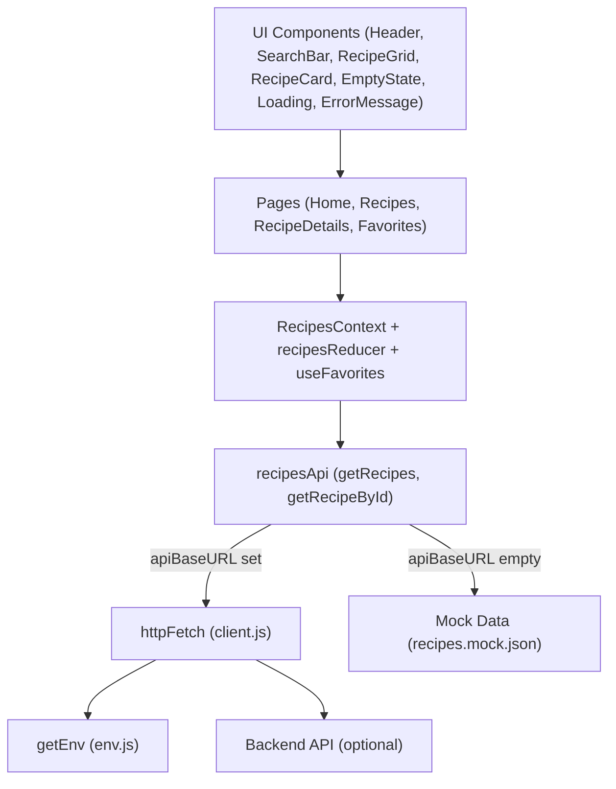

# Recipe App Frontend Architecture

## Overview and Goals
The Recipe App frontend is a lightweight React application for browsing, searching, and managing recipes. It provides a clean UI to:
- Discover recipes via a search-first experience
- View recipe details
- Mark recipes as favorites (persisted locally)
- Operate with a mock data fallback when no backend is configured

Primary goals are simplicity, fast load, accessible UI, clean routing, and a clear separation between UI, state, and data fetching, with an easy path to integrate a backend later.

## Container Summary
- Container: recipe_app_frontend
- Platform: Web (React 18)
- Router: react-router-dom v6
- State: Context + Reducer for recipes, plus a custom hook for persisted favorites
- API Layer: Small fetch wrapper + recipes API module with mock fallback
- Theme: Ocean Professional via CSS tokens with optional dark mode toggle
- Tests: React Testing Library for routing and hooks; API mock mode tests
- Dev server: CRA (react-scripts), runs at http://localhost:3000 by default

## Tech Stack
- React 18: SPA UI framework
- react-router-dom v6: Client-side routing
- Context + Reducer: RecipesContext (global state) and recipesReducer for fetch lifecycle, query, and favorites sync
- CSS theme: src/theme/theme.css defines Ocean Professional tokens and utilities
- Jest + React Testing Library: Testing
- CRA (react-scripts): Build/serve

Key references:
- Entry: src/index.js
- Root: src/App.js
- Router: src/router/AppRouter.jsx
- State: src/state/RecipesContext.jsx, src/state/recipesReducer.js, src/state/useFavorites.js
- API: src/config/env.js, src/api/client.js, src/api/recipesApi.js
- Theme: src/theme/theme.css

## High-level Architecture
The app is organized around a clear separation of concerns:
- UI components render views and dispatch user actions
- RecipesContext provides global state and action creators that coordinate fetch lifecycle
- The API layer abstracts network calls and handles mock fallback when no API base URL is configured
- The theme provides design tokens and utility classes for a consistent look and feel

High-level flow:
1. User interacts with UI (e.g., SearchBar submit, Favorite toggle).
2. UI triggers navigation and/or context actions.
3. Context actions call recipesApi, which delegates to httpFetch if an API base is configured or to mock data otherwise.
4. Reducer updates state; UI re-renders accordingly.

Diagram description:
- UI Layer: Header, Pages (Home, Recipes, RecipeDetails, Favorites), Components (SearchBar, RecipeGrid, RecipeCard, EmptyState, Loading, ErrorMessage)
- State Layer: RecipesContext + recipesReducer + useFavorites
- Data Layer: env.js -> api/client.js (httpFetch) -> api/recipesApi.js -> real backend or src/mocks/recipes.mock.json

## Component Architecture
### Header
- src/components/Header.jsx
- Sticky top navigation with links to Home, Recipes, Favorites
- Uses NavLink for active styles and useNavigate for brand click
- Reflects theme tokens for colors and gradients

### SearchBar
- src/components/SearchBar.jsx
- Form with input and submit button; on submit navigates to /recipes?q=<query>
- Reads existing ?q when present; sizes md or lg for different contexts

### RecipeCard
- src/components/RecipeCard.jsx
- Displays image, title, description snippet
- Favorite toggle button with ARIA states
- Links to details page via Link to /recipes/:id

### RecipeGrid
- src/components/RecipeGrid.jsx
- Responsive grid of RecipeCard with favorites Set passed for UI state

### EmptyState
- src/components/EmptyState.jsx
- Friendly message with optional action slot, used for no results or empty favorites

### Loading
- src/components/Loading.jsx
- Simple accessible loading indicator with customizable text

### ErrorMessage
- src/components/ErrorMessage.jsx
- Accessible alert box styled via theme tokens

## Pages and Responsibilities
- Home (src/pages/Home.jsx): Search-first hero with large SearchBar
- Recipes (src/pages/Recipes.jsx): Reads ?q, fetches recipes via recipesApi, handles loading/error/empty and renders RecipeGrid with favorites interactions
- RecipeDetails (src/pages/RecipeDetails.jsx): Loads a single recipe by :id, handles loading/error/not-found, provides a favorite toggle
- Favorites (src/pages/Favorites.jsx): Reads favorites from localStorage and renders a filtered list from recipe data; empty state if none

## Routing Topology
- src/router/AppRouter.jsx defines:
  - / -> Home
  - /recipes -> Recipes (supports ?q= for search)
  - /recipes/:id -> RecipeDetails
  - /favorites -> Favorites
- BrowserRouter is provided at src/index.js; do not wrap another Router inside AppRouter
- Header renders outside Routes to persist navigation across pages

## State Management Design
- RecipesContext (src/state/RecipesContext.jsx)
  - Exposes state: { query, items, loading, error, favorites }
  - Exposes actions: setQuery(q), triggerFetch(query), toggleFavorite(id), setFavorites(idsSet)
  - Syncs favorites from useFavorites into reducer state
- recipesReducer (src/state/recipesReducer.js)
  - actionTypes: FETCH_START, FETCH_SUCCESS, FETCH_FAILURE, SET_QUERY, FAVORITES_SYNC, TOGGLE_FAVORITE (optional local use)
  - initialState includes favorites as Set<string>
- Favorites hook (src/state/useFavorites.js)
  - Manages localStorage persistence under key "favorites"
  - Provides favorites Set, toggleFavorite(id), and setFavoritesDirect(value)

Actions and lifecycle:
- FETCH_START: loading=true, error cleared
- FETCH_SUCCESS: items set, loading=false
- FETCH_FAILURE: error set, loading=false
- SET_QUERY: updates query (UI can also derive query from URL)
- FAVORITES_SYNC: normalizes incoming favorites into a Set

## Data Flow
- Search
  - Home/SearchBar -> navigate to /recipes?q=query
  - Recipes page effect reads ?q, calls getRecipes({ q }), renders Loading/Error/Empty/Grid
- Favorites
  - Favorite toggle -> useFavorites updates localStorage -> RecipesContext syncs Set -> UI reflects via prop/state
- Details
  - Route /recipes/:id -> getRecipeById(id) -> Loading/Error/Details view
- Mock fallback
  - If no API base URL, recipesApi uses src/mocks/recipes.mock.json and performs client-side filtering and pagination

## API Layer
- src/config/env.js
  - getEnv() resolves apiBaseURL from REACT_APP_API_BASE or REACT_APP_BACKEND_URL
  - Empty string => mock mode; provides nodeEnv too
- src/api/client.js
  - httpFetch(path, options, config)
  - Base URL resolution, timeout (default 15s), JSON parsing, normalized errors
- src/api/recipesApi.js
  - getRecipes({ q, page, pageSize, ingredients })
    - Mock mode: filters mock JSON by title/description; naive ingredient filtering; simple pagination
    - API mode: builds query string, calls httpFetch('recipes?...')
  - getRecipeById(id)
    - Mock mode: finds in mock JSON
    - API mode: httpFetch(`recipes/${id}`)
- Mock data: src/mocks/recipes.mock.json

## Environment Variables and Mock Mode
Recognized environment variables in this container (from Request Details and code):
- REACT_APP_API_BASE: Preferred API base URL for HTTP calls
- REACT_APP_BACKEND_URL: Fallback base URL if API_BASE is not set
- REACT_APP_NODE_ENV: Optional explicit environment override; falls back to NODE_ENV
- Other container_env present but not directly consumed by current code: REACT_APP_FRONTEND_URL, REACT_APP_WS_URL, REACT_APP_NEXT_TELEMETRY_DISABLED, REACT_APP_ENABLE_SOURCE_MAPS, REACT_APP_PORT, REACT_APP_TRUST_PROXY, REACT_APP_LOG_LEVEL, REACT_APP_HEALTHCHECK_PATH, REACT_APP_FEATURE_FLAGS, REACT_APP_EXPERIMENTS_ENABLED

Mock mode trigger:
- If both REACT_APP_API_BASE and REACT_APP_BACKEND_URL are unset or blank, getEnv().apiBaseURL returns an empty string, and recipesApi uses mock data rather than network.

## Theming
- Ocean Professional theme in src/theme/theme.css defines design tokens:
  - Colors (primary blue, secondary/amber, error), background, surface, text, border
  - Shadows, radii, spacing, gradients, interactive states
  - Button utilities (.btn, .btn-amber), .container layout, .card, .nav-active
  - Dark mode via [data-theme="dark"]; toggled by App.js button that sets documentElement attribute
- Accessibility considerations:
  - Focus rings via --focus-ring for interactive elements
  - ARIA attributes: role="search" in SearchBar, role="alert" in ErrorMessage, aria-live in Loading, aria-pressed in favorite buttons
  - Color contrast maintained by token choices

## Error Handling and Loading Patterns
- Loading component used in Recipes and RecipeDetails while data is being fetched
- ErrorMessage displays normalized error messages from httpFetch/recipesApi
- Recipes: handles loading, error, empty results with EmptyState
- Details: handles loading, error, and not found

## Performance Considerations
- URL-driven query enables shareable and back/forward-friendly searches
- Pagination hooks are present in recipesApi for future use; mock mode slices results by page/pageSize
- Memoization opportunities:
  - useMemo for URLSearchParams in Recipes (useQuery)
  - Consider React.memo for RecipeCard and RecipeGrid to reduce re-renders with large lists
- Lazy loading:
  - Potential to code-split routes with React.lazy/Suspense as the app grows
- Favor Set for favorites for O(1) lookups

## Testing Approach and Coverage
- Unit/integration tests using React Testing Library:
  - src/__tests__/routing.test.jsx: renders routes and verifies navigation via Header links
  - src/__tests__/recipesApi.test.js: exercises recipesApi in mock mode (pagination, query filter, get by id, required id error)
  - src/__tests__/favorites.test.js: validates useFavorites hook behavior and localStorage persistence
- Jest-DOM is configured in src/setupTests.js for matchers like toBeInTheDocument

## Build/Run Assumptions and Backend Integration
- Development server: react-scripts start on port 3000
- Build: react-scripts build
- Tests: react-scripts test
- Future backend integration:
  - Set REACT_APP_API_BASE (preferred) or REACT_APP_BACKEND_URL to point to the backend (e.g., https://api.example.com)
  - Ensure backend supports endpoints:
    - GET /recipes?q=&page=&pageSize=&ingredients=...
    - GET /recipes/:id
  - httpFetch includes sensible defaults and timeout; extend headers/auth as needed

## Security Considerations
- No secrets in frontend; environment variables are build-time injected
- Normalized error handling avoids leaking stack traces
- When integrating backend:
  - Consider authentication headers and CSRF if same-origin
  - Validate and sanitize all user-supplied inputs on the server; client sends query params plainly
  - Use HTTPS endpoints in production
- LocalStorage stores only a list of favorite IDs (non-sensitive)

## Extension Points
- Add pagination UI controls to Recipes page; wire to page/pageSize in recipesApi
- Add advanced filters (ingredients, cuisine) and reflect in URL/recipesApi
- Introduce global query and fetch orchestration via RecipesContext across pages (already prepared)
- Implement infinite scrolling or virtualized list for large datasets
- Add image lazy loading for RecipeCard
- Add user auth and sync favorites server-side
- Code-split routes with React.lazy for faster initial load
- Add analytics and feature flags (REACT_APP_FEATURE_FLAGS placeholder exists in container env list)

## Routing and State Quick Reference
- BrowserRouter: src/index.js
- Routes: src/router/AppRouter.jsx
- Recipes state/actions: src/state/RecipesContext.jsx, src/state/recipesReducer.js
- Favorites persistence: src/state/useFavorites.js

## API Quick Reference
- Environment resolution: src/config/env.js (REACT_APP_API_BASE > REACT_APP_BACKEND_URL)
- HTTP client: src/api/client.js (httpFetch with timeout and normalized errors)
- Recipes API: src/api/recipesApi.js with mock fallback to src/mocks/recipes.mock.json

## Mermaid: High-Level Module Diagram

## Runbook
- Development: npm start (http://localhost:3000)
- Tests: npm test
- Build: npm run build
- Configure backend: set REACT_APP_API_BASE or REACT_APP_BACKEND_URL; if neither is set, mock mode is used

## Code References
- src/index.js
- src/App.js
- src/router/AppRouter.jsx
- src/components/{Header.jsx,SearchBar.jsx,RecipeGrid.jsx,RecipeCard.jsx,EmptyState.jsx,Loading.jsx,ErrorMessage.jsx}
- src/pages/{Home.jsx,Recipes.jsx,RecipeDetails.jsx,Favorites.jsx}
- src/state/{RecipesContext.jsx,recipesReducer.js,useFavorites.js}
- src/api/{client.js,recipesApi.js}
- src/config/env.js
- src/mocks/recipes.mock.json
- src/theme/theme.css
